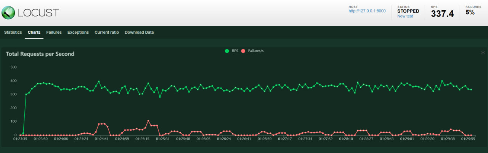
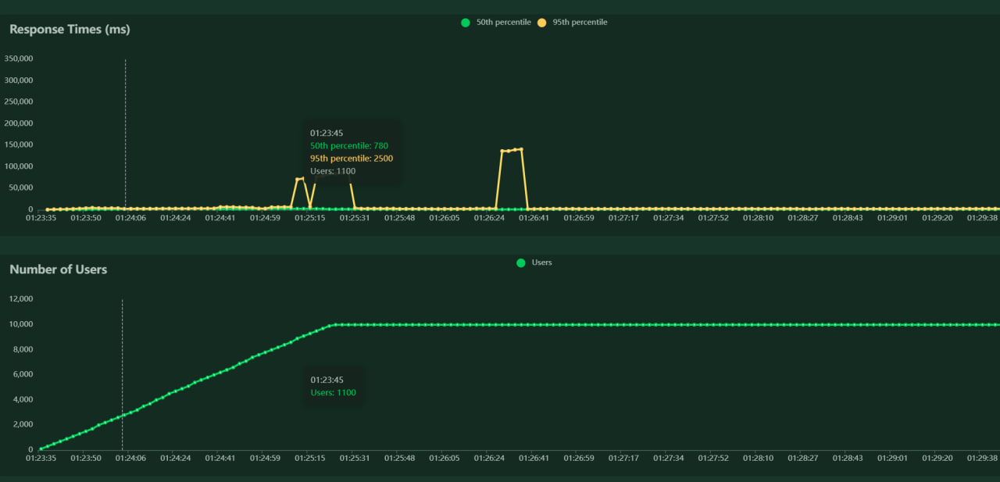

# CoinsExchangeRates service
Данный сервис позволяет отслеживать курсы валют с бирж


## Особенности проекта
В проекте используется ```FastAPI```, он автоматически генерирует swagger документацию по эндпоинту `/docs`, работает *асинхронно*

Для гибкости разработки и контроля состояния объектов в проекте используется ```Dependency Injection (DI)``` с помощью DI контейнеров из библиотеки [Dependency Injector](https://python-dependency-injector.ets-labs.org/)

Запросы к API кэшируются, сохраняя информацию в `Redis`, инвалидация кэша происходит по истечении 5 секунд.

Т.к. мне не удалось найти подходящие пары в [BinanceAPI](https://binance-docs.github.io/apidocs/websocket_api/en/#symbol-price-ticker),
то необходимые данные беру из [CoingeckoAPI](https://www.coingecko.com/api/documentation). Т.к. данное API не предоставляет 
взаимодействие по `websocket` протоколу, то запущена переидоческая `celery` задача, которая получает данные по запросу, проверяет, что с 
момента последнего их получения произошли изменения, если это так, то записывает новые данные в базу, помечая предыдущие как неактуальные.


## Как запустить
Чтобы запустить данный репозиторий в режиме разработки необходимо выполнить последовательность команд:
```
git clone https://github.com/coIorbIind/coins_exchange_rates.git
# Заполнить .env_template (необязательно) и поменять имя на .env
docker compose up --build
```
После этого на машине запустятся следующие контейнеры
* `db` - инстанс postgreSQL
* `redis_for_celery` - инстанс Redis
* `exchanger` - основной контейнер, запускающий приложение через gunicorn
* `celery` - запускает worker'в для выполнения фоновых задач


## Структура репозитория
```
.
├── alembic - директория, хранящая настройки для миграций и сами миграции
├── entrypoints - скрипты для запуска контейнеров докера
├── logs - папка с логами сервиса
└── src
    └── coins_exchange_rates - основной код сервиса
        ├── api
            ├── routes — API endpoints
            └── schemas — схемы представлений для endpoint'ов
       ├── config - директория с настройками проекта
       ├── containers - директория с DI контейнерами
       ├── core
            ├── exceptions — директория для хранения ошибок и их обработчиков
            ├── logger.py - файл с настройками логирования
            ├── main.py — файл с конфигурацией FastAPI приложения
            └── README.md
       ├── db - директория с настройками проекта
            ├── crud — директория с репозиториями
            ├── models — директория с ORM моделями
            ├── schemas — директория с DTO для моделей
            └── database - файл с настройками подключения к БД
       ├── services - директория с сервисами для работы с внешними API и репозиториями БД
       ├── tasks - директория с настройками Celery и фоновых задач
       ├── tests - директория с тестами
       ├── utils - директория с утилитами (содержит настройки кэширования и locist'a)
       ├── asgi.py - файл для запуска asgi приложения 
       ├── pytest.ini - конфиг файл для pytest'а
       └── README.md
    └── requirements.txt - файл с зависимостями
├── .env_template - файл с шаблонными настройками проекта
├── .gitignore
├── alembic.ini - конфиг файл для alemnic'а
├── docker-compose.yml
├── Dockerfile
└── README.md
```


## Отчёт по тестированию
Было проведено нагрузочное тестирование с помощью locust, графики представлены ниже



Временные пики скорее всего связаны с другими процессами, запущенными на локальном компьютере при проведении тестирования +
само тестирование проводилось на той же машине, на которой было запущено приложение.
